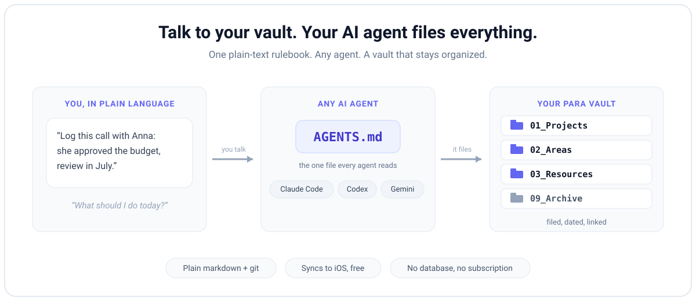

# AI Second Brain

[](https://github.com/federicodecillia/ai-second-brain/actions/workflows/smoke.yml)
[](LICENSE)

**A second brain any AI agent can operate.** One canonical `AGENTS.md` rulebook: Claude Code, Codex, and Gemini/Antigravity all read the same rules and maintain the same vault. Built on PARA. Plain markdown + git, no database, no subscription. Working vault in 2 minutes, fully personalized in 15.

Works as a **personal** brain or a shared **company brain** — a team, task assignment, and a lightweight sales pipeline. `setup.sh` asks which; the company setup is documented in [`docs/company-brain.md`](docs/company-brain.md).



## What your agent can do with it

Once set up, you talk to your vault in plain language:

- *"Log this meeting with Anna: she approved the budget, next review in July"* → filed in the right area, dated entry, linked from today's daily note
- *"What should I do today?"* → reads your task dashboard: overdue, due today, priorities
- *"Add a task: send the proposal to Marco by Friday, high priority"* → a properly tagged task line in the right file, visible in the dashboard
- *"What do I know about ACME Corp?"* → pulls the note, linked people, and past dated entries
- *"Start a project for the website redesign, deadline end of September"* → project folder with MOC + tasks, linked to its area
- *(Sunday morning, on a schedule)* → it empties your inbox, writes a digest of the week, and flags stale notes, on its own

The agent follows the same written rules every time, whichever agent you use. That last one is the point: schedule `maintenance.md` and the brain maintains itself, getting sharper every week instead of going stale. See [docs/automation.md](docs/automation.md).

## Why this exists
- **PARA structure** ([Tiago Forte](https://fortelabs.com/blog/para/)): organize by actionability, not topic.
- **AI-first**: notes are written and maintained with an agent, following Karpathy's LLM-Wiki / append-and-review pattern.
- **Multi-agent**: one canonical `AGENTS.md` (with `CLAUDE.md` / `GEMINI.md` symlinks) means every agent reads the same rules. See `docs/philosophy.md`.

## Get started

Clone and personalize, install two Obsidian plugins, open the vault with your agent, then optionally turn on autopilot and put it on your phone. About 15 minutes total, or 2 for a bare working vault. Each step links to a deeper guide if you want it.

### 1. Clone and personalize it (2 min)
```
git clone https://github.com/federicodecillia/ai-second-brain.git my-second-brain && cd my-second-brain && ./setup.sh
```
**macOS / Linux:** any terminal. **Windows:** run it in **Git Bash** (ships with [Git for Windows](https://git-scm.com)), not PowerShell or CMD — `setup.sh` is a shell script. Everything after this step is identical on all three.
`setup.sh` asks **personal or company/team**, fills in your name(s), language and areas, detaches the vault into your own fresh git repo, and (if you want) publishes it to GitHub for you (`gh repo create`, private by default).
In a hurry? `./setup.sh --quick` skips every question and gives you a working vault now; re-run it anytime to personalize. Want richer context? Skip the form and let your agent **interview you** instead — both paths are in [docs/onboarding.md](docs/onboarding.md).

### 2. Install the Obsidian plugins (2 min)
Open the folder as a vault (Obsidian → *Open folder as vault*). Then turn on two community plugins and one core plugin:
- **Tasks** — builds your task dashboard (overdue / today / by project) from your `- [ ]` lines.
- **Dataview** — powers the live tables in area, people and sales-pipeline notes.
- **Templates** (core, built-in) — fills the `{{date}}` / `{{title}}` tokens when you add a note from a template.

A freshly cloned vault downloads these but does **not** auto-enable them, so flip them on yourself. Exactly which plugin powers what, plus the "my views show raw code" fix: [docs/plugin-setup.md](docs/plugin-setup.md).

### 3. Open it with your agent (1 min)
Open the vault in Claude Code, Codex, or Gemini / Antigravity and ask *"What is the structure of this vault?"*. You should get a clean PARA answer. Start the agent **from inside the vault folder** — that is how it finds `AGENTS.md`, the rulebook it reads before touching anything. From there you just talk to it (see the examples above). How one `AGENTS.md` keeps all three agents in sync: [docs/multi-agent-setup.md](docs/multi-agent-setup.md).

### 4. Turn on autopilot (optional, 2 min)
Drop anything into `00_Inbox/` and let a scheduled run sort it. Tell your agent *"set up a scheduled task that runs maintenance.md every Sunday at 08:00"* and it files the inbox, writes a weekly digest to `digest.md`, and health-checks the vault, unattended. Cadence, a local-cron path for any agent, and the read-only safety rule: [docs/automation.md](docs/automation.md).

### 5. Back it up, and put it on your phone (optional, 5 min)
Push the vault to a **private** GitHub repo and let the Obsidian Git plugin commit and sync it every few minutes: backup and version history with nothing to remember. The same backbone then syncs to Obsidian on iOS for free, no Obsidian Sync subscription. Both halves, including the access token GitHub now requires instead of a password: [docs/mobile-sync.md](docs/mobile-sync.md). On macOS you can also capture by voice ("Hey Siri, remind me to…") and have your agent file those items into the vault: [docs/reminders-capture.md](docs/reminders-capture.md).

## Documentation
Start with **onboarding**; reach for the rest only when you need them.

| Guide | What it covers |
|---|---|
| [onboarding.md](docs/onboarding.md) | The full setup, start to finish, in ~15 minutes. |
| [plugin-setup.md](docs/plugin-setup.md) | Which plugins to install and the exact feature each one powers. |
| [multi-agent-setup.md](docs/multi-agent-setup.md) | How the single `AGENTS.md` + symlinks keep Claude, Codex and Gemini in sync. |
| [mobile-sync.md](docs/mobile-sync.md) | Free iOS sync over git: token setup, the 403 fix, anti-conflict rule. |
| [reminders-capture.md](docs/reminders-capture.md) | Capture from Siri / Apple Reminders on macOS and pull items into the vault. |
| [automation.md](docs/automation.md) | Schedule `maintenance.md` so the brain files its inbox and writes a digest on its own. |
| [company-brain.md](docs/company-brain.md) | Run it as a shared team brain: task assignment + a lightweight sales pipeline. |
| [customization.md](docs/customization.md) | Adapt areas and templates to your field; when to go pro. |
| [philosophy.md](docs/philosophy.md) | The PARA + Karpathy ideas the vault is built on. |

## What's inside
```
00_Inbox/  01_Projects/  02_Areas/  03_Resources/{templates,people,context}  09_Archive/  Daily/
AGENTS.md (+CLAUDE.md/GEMINI.md)  hub.md  routines.md  dashboard.md  index.md  MEMORY.md
maintenance.md (autopilot routine)  digest.md (its output)  setup.sh  docs/
```
Plus an example project showing the conventions, six universal note templates, and a smoke-tested setup (CI runs the full new-user flow on every change).

**Requirements:** git, an agent CLI (Claude Code / Codex / Gemini), and Obsidian to read the vault. Nothing else — no database, no runtime, no account. Works on macOS, Linux and Windows (Git Bash).

## Customize / go pro
Adapt areas and templates to your field: `docs/customization.md`.

**Want a hand?** I help at both ends: a quick guided setup to get you live in a single call, and deeper builds such as CRM/sales workflows, custom agent skills, MCP automations (calendar, email, payments), and on-the-go task capture from your phone. [Get in touch](https://www.linkedin.com/in/federicodecillia/).

## License & credits
MIT. Built on [PARA](https://fortelabs.com/blog/para/) by Tiago Forte and the [LLM Wiki](https://gist.github.com/karpathy/442a6bf555914893e9891c11519de94f) / [append-and-review](https://karpathy.bearblog.dev/the-append-and-review-note/) pattern by Andrej Karpathy. Multi-agent via the [agents.md](https://agents.md) standard.
Author: Federico De Cillia.
